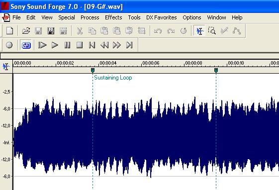

Sample-sets
***********

There are many free sample-sets available for download on the `SamplerBox website <http://www.samplerbox.org/instruments>`_. You may also use SFZ (soundfont) packages
or even create your own sets!

.. _where-to-put-samples:

Where to put samples
====================

SamplerBox looks for sample-set directories in three places, in this order of priority:

1. User-defined directory in ``config.ini``
2. ``/media/`` (USB drive)
3. ``/samples/`` (SD card)

.. note::

    If the user-defined directory cannot be found, SamplerBox will look for a mounted USB drive. Failing that, the default ``/samples/`` directory
    will be used.

USB drive
---------

This is the easiest way to get samples from your computer to your SamplerBox. By default, SamplerBox will look for directories in the root of your
USB drive. A setlist.txt file will be automatically generated that will include the name of every directory listed alphanumerically. You can
reorder the lines in the setlist.txt file on your PC, or do it via the :ref:`system-mode-1` menu.

.. hint::

    If you'd prefer to have your sample-sets in a subdirectory on your USB drive (or indeed anywhere else) find the line ``SAMPLES_DIR = None`` in your ``config.ini`` and change it to
    ``SAMPLES_DIR = /media/subdirectory``.

.. _sample-set-sdcard:

SD card (advanced)
------------------

A third partition on your SD card is available for samples (mounted to ``/samples/``). When the Raspberry Pi is running it is
mounted as read-only to extend the life of the SD card.

To manage your sample-sets here you must first remount the partition as read-write by entering the following on the Raspberry Pi's command line:

``mount -o remount,rw /samples``

You can now upload/delete sample-sets via your SFTP client.

It is also possible to manage samples on your PC computer. However, Windows machines only detect the first partition of an SD card.
In the case of SamplerBox this is the ``/boot/`` partition. There are ways to gain access to other partitions but that is not covered here.

.. note::

    SamplerBox issues mounting commands from the program. This is how it can manage sample-sets and the setlist from the within the program.

--------------------------------------

Make your own samples
=====================

Samples
-------

SamplerBox currently only reads WAV files. Fortunately every modern audio editor can work with them.

Use your favourite audio editor to cut up your instrument into note samples.

Loop markers
------------

To save loop markers to WAV files you must use a sound editor that is capable of this, eg `Sony Soundforge <https://sound-forge-pro.en.softonic.com/>`_.
SamplerBox will recognise loop markers and loop your sounds!

A premium alternative is `Extreme Sample Converter <http://www.extranslator.com/>`_ which can auto-detect and save suitable loop markers.

-----------------------------------------

Make a sample-set
=================

Once you have a collection of samples you must first put them in a directory into :ref:`one of the three directories listed above <where-to-put-samples>` so that SamplerBox can find them.

Now you need to prepare the directory in a way that SamplerBox can read the samples. There are 4 ways to do this:

1) Name every sample file by its note name. eg C1.wav, F#1.wav, C2.wav, F#2.wav etc

2) Name every sample file by its corresponding MIDI number. eg 40.wav, 45.wav, 50.wav, 55.wav etc

3) Create a text file named ``definition.txt`` in your sample-set's directory. :ref:`Instructions below <definition-files>`.

4) Use a sample-set with a accompanying SFZ definition file, or create your own if you prefer (instructions not covered here).

.. note::

    SamplerBox will attempt to fill all missing notes.

.. warning::

    Not all options found in SFZ files will be read by SamplerBox. eg attack, decay, EQ.

-----------------------------------------

.. _definition-files:

Definition files
================

If you're not naming your samples by the convention ``45.wav``, ``46.wav`` etc, or ``C1.wav``, ``C#1.wav`` etc, you can
create a ``definition.txt`` file inside a sample-set's directory. This file tells SamplerBox how to read and playback
samples.

Definition of sample names
--------------------------

In the most basic situation, the sample files within the folders have to be called ``0.wav``, ``2.wav`` and so on until ``127.wav``.

A more advanced way to manage sample-sets is to use a ``definition.txt`` which uses filename definitions and keywords to determine
how SamplerBox finds and performs samples.

------------------------------

.. _global-keywords:

Global behaviour keywords
-------------------------

These are global keywords in the definition.txt for influencing the playback upon load of a preset/sample-set.
For every keyword not defined in the file, the default value is used.

.. note::

    In :ref:`system-mode-1` it is possible to modify these keywords from menu.

%%mode
^^^^^^

+--------+-----------------------------------------------------------------------------------------+
|%%mode= |Description                                                                              |
+========+=========================================================================================+
|Keyb    | | (Default) "Normal": end on note-off and use loop markers if any while key is pressed  |
|        | | (original SamplerBox).                                                                |
+--------+-----------------------------------------------------------------------------------------+
|Once    | | "Playback": play sample from start to end ignoring standard note-off.                 |
+--------+-----------------------------------------------------------------------------------------+
|On64    | | Like "once" but now only notes 0-63 can be used; use note+64 to stop playback         |
|        | | (=send note-off)                                                                      |
+--------+-----------------------------------------------------------------------------------------+
|Loop    | | Like "on64", but also loop markers will be recognized; more versitale than "On64"     |
+--------+-----------------------------------------------------------------------------------------+
|Loo2    | | Like "loop", but the loop will stop when playing the same note (=2nd keypress sends   |
|        | | note-off).If the sample has no loop markers it will stop when exhausted, but pressing |
|        | | the key a second time is still required before the sample can be played again!        |
|        | | This mode mimicks Korg-KAOSS and some groove samplers.                                |
+--------+-----------------------------------------------------------------------------------------+

%%velmode
^^^^^^^^^

The way that volume is derived from the velocity.

+-----------+--------------------------------------------------------------------------------------+
|%%velmode= |Description                                                                           |
+===========+======================================================================================+
|Sample     | | (Default) Volume equals the value in the sample, so it requires multiple           |
|           | | samples using the %velocity parameter to get differentiation (original SamplerBox).|
+-----------+--------------------------------------------------------------------------------------+
|Accurate   | | "Playback": play sample from start to end ignoring standard note-off.              |
+-----------+--------------------------------------------------------------------------------------+

%%release
^^^^^^^^^

Time to fadeout playback volume from the sample level to zero after the key is released in tenth's of seconds.

.. code-block:: text

    Default = 30 (~0.5s)
    Allowed values: 0-127 (range of 0-2s)

%%gain
^^^^^^

Adapts sample volume before alsamixer by means of a multiplication factor. With this you can adapt presets to
SamplerBox input without actually changing the wav files.

.. code-block:: text

    Default = 1.0

.. warning::

    Setting this value too high may cause distorted playback.

%%transpose
^^^^^^^^^^^

Transpose up or down a desired number of semitones.

.. code-block:: text

    Default = 0

%%pitchbend
^^^^^^^^^^^

The depth of the pitchbend in semitones.

Possible values: 0-12, where 12 means range is 1 octave up and down and zero disables the pitch wheel/joystick.

.. code-block:: text

    Default = 7

-----------------------------------

.. _sample-level-keywords:

Sample-level behaviour keywords
-------------------------------

In addition to global keywords, sample-level keywords can be used. Some of these override global keywords. For example:

.. code-block:: text

    saw2.wav, %midinote=60, %voice=2, %fillnote=N

%notename
^^^^^^^^^

.. code-block:: text

    Values = C1, C2, C3, D#3, F#4, etc.

Define a sample's MIDI note by its note name.

%midinote
^^^^^^^^^

.. code-block:: text

    Value range = 0-127

Define a sample's MIDI note. For example 60 corresponds to middle C = C4.

%channel
^^^^^^^^

.. code-block:: text

    Value range = 0-16

.. code-block:: text

    Default = 0

**NB:** 0 = all channels.

%velocity
^^^^^^^^^

.. code-block:: text

    Value range = 1-127

.. code-block:: text

    Default = 127

A velocity sample is used from its value upwards till the next sample. Velocity values below lowest sample will use this lowest one.

%voice
^^^^^^

.. code-block:: text

    Value range = 1-4

.. code-block:: text

    Default = 1

This enables loading different instruments in one sample set, so that switching between them has no delay.

%seq
^^^^

.. code-block:: text

    Value range = 1-127

.. code-block:: text

    Default = 1

If you have multiple versions of the same sample (eg different snare samples) you can number them. On playback a random sample will be selected.

%fillnote
^^^^^^^^^

.. code-block:: text

    Values = Y, N, G

.. code-block:: text

    Default = G (use global setting)

Determines whether the sample at the specified note will fill surrounding notes.

%mode
^^^^^

.. code-block:: text

    Values = Once

.. code-block:: text

    Default = None

Currently only accepts Once. See ``%%mode`` above for its functionality.

%mutegroup
^^^^^^^^^^

.. code-block:: text

    Value range = 0-127

.. code-block:: text

    Default = 0 (no mute group)

Assign sample lines to a mutegroup. When performing a note from a mutegroup, any other sounds from the same
group will be stopped/choked. Useful for instruments like hi-hats.

-----------------------------------

Examples
--------

.. _definition-examples:

1. Velocity
^^^^^^^^^^^

The original `GrandPiano <http://www.samplerbox.org/instruments>`_ set uses multiple lines specifying the wav's to be
selected and the corresponding fixed velocity value. Remember that default velocity is 127.

**File names:**

.. code-block:: text

    D#5v16.wav
    D#6v4.wav
    D#6v7.wav
    D#6v11.wav
    D#6v14.wav
    D#6v16.wav
    D#7v4.wav

**definition.txt:**

.. code-block:: text

    %%mode=Keyb
    %%velmode=Sample
    %notenamev4.wav,%velocity=40
    %notenamev7.wav,%velocity=60
    %notenamev11.wav,%velocity=80
    %notenamev14.wav,%velocity=100
    %notenamev16.wav

Alternatively, you can set the global velocity mode (``%%velmode``) to either ``Accurate`` (default) or ``Sample``.

``Accurate`` will scale the volume of a sample based on the velocity of the note played.

``Sample`` will look for velocity values in the ``definition.txt`` (as in the example above).

.. code-block:: text

    %%mode=Keyb
    %%velmode=Accurate
    %notenamev14.wav
    %notenamev16.wav

2. Naming and looping
^^^^^^^^^^^^^^^^^^^^^

I often use this definition set, which makes it possible to give the loops and fills a self explaining name.
Directory on the left is interpreted correctly.

**File names:**

.. code-block:: text

    03 Alesis-Fusion-Bass-Loop.wav
    4 takkeherrie.wav
    6.wav
    11 Carol.wav
    20 130-bpm-electro-synth-loop.wav
    21 Aggressive-saw-synth-bass-loop.wav

**definition.txt:**

.. code-block:: text

    %%mode=Loop
    %%velmode=Accurate
    %midinote*.wav

3. Voices
^^^^^^^^^

This is set 3 on the SDcard with voices. It uses actually one velocity range of the GrandPiano combined with
Saw. The saw WAV's are renamed with midinumber prefixed with notename plus an "m".

**File names:**

.. code-block:: text

    A5v12.wav
    A6v12.wav
    A7v12.wav
    C1v12.wav
    c2m36.wav
    C2v12.wav
    c3m48.wav
    C3v12.wav

**definition.txt:**

.. code-block:: text

    %%mode=Keyb
    %%release=3
    %%velmode=Accurate
    %notenamev*.wav
    %notenamem*.wav,%voice=2

.. hint::

    You can also define the voice in the file name. eg ``c3_voice2.wav`` will be found with ``%notename_voice%voice*.wav`` in the definition.txt

4. Randomization
^^^^^^^^^^^^^^^^

You might have a sample-set with a variation of samples of the same instrument note. In this example there are 4
samples/recordings of a kick drum and a snare drum. The ``%seq`` keyword tells SamplerBox to play back a
different version of the kick or snare for every hit, thus giving a more realistic performance.

**File names:**

.. code-block:: text

    bonham-kick-1.wav
    bonham-kick-2.wav
    bonham-kick-3.wav
    bonham-kick-4.wav
    bonham-snare-1.wav
    bonham-snare-2.wav
    bonham-snare-3.wav
    bonham-snare-4.wav

**definition.txt:**

.. code-block:: text

    %%mode=Once
    %%velmode=Accurate
    bonham-kick-%seq.wav
    bonham-snare-%seq.wav

.. note::

    SamplerBox may randomize samples in an order like this: 3-6-2-1-8-7-2. Notice how there are no consecutive repeats.

5. Playback mode
^^^^^^^^^^^^^^^^

In this example the global ``%%mode`` is ``Keyb`` (normal playback), but 1 sample plays back from start to end ignoring the standard note-off.

**File names:**

.. code-block:: text

    mellotron C1.wav
    mellotron E1.wav
    mellotron G1.wav
    aeroplane-sample.wav

**definition.txt:**

.. code-block:: text

    %%mode=Keyb
    %%velmode=Accurate
    mellotron %notename.wav
    aeroplane-sample.wav, %mode=Once