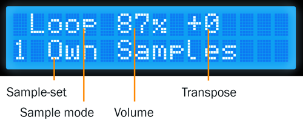
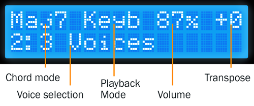

Using SamplerBox
****************

.. _system-modes:

Introduction
============

SamplerBox has two system modes available which is determined by the ``SYSTEM_MODE`` option in :ref:`config.ini <config-ini>`.

+----------------------+---------------------------------------------------------------------------------------+
|:ref:`system-mode-1`  || config.ini: ``SYSTEM_MODE = 1``                                                      |
|                      ||                                                                                      |
|                      || A more advanced system that allows the user to:                                      |
|                      |                                                                                       |
|                      | * manage the order of their sample-sets (setlist mode)                                |
|                      | * manage variables defined in a sample-set's definition.txt                           |
|                      | * map MIDI controls to various playback and system functions                          |
|                      | * manage system settings by modifying the config.ini                                  |
+----------------------+---------------------------------------------------------------------------------------+
|:ref:`system-mode-2`  || config.ini: ``SYSTEM_MODE = 2``                                                      |
|                      ||                                                                                      |
|                      || A simpler system that relies on the user preparing sample-sets and                   |
|                      || config.ini on a computer. Some functions available.                                  |
+----------------------+---------------------------------------------------------------------------------------+

--------------------------------------

.. _system-mode-1:

System mode 1
=============

.. image:: images/LCD-display-areas-system-1.png

*Displaying current preset '3 Mello+Sawtooth' which has 2 voices available. The next preset is '4 Korg Little Bits'. The 'S' indicates samples are still loading in the background*

A menu system has been implemented to access:

* :ref:`setlist-functions`
* :ref:`edit-definitions`
* :ref:`auto-chords`
* :ref:`midi-mapping`
* :ref:`system-settings`
* :ref:`invert-sustain`
* :ref:`reboot-system`

.. image:: images/LCD-menu-animation.gif

*In the menu system*


.. warning::

    This feature assumes you have a `HD44780 LCD <https://en.wikipedia.org/wiki/Hitachi_HD44780_LCD_controller>`_
    module wired to your Raspberry Pi, or you have purchased an official SamplerBox Player. You may need to manually define the GPIO pins it is connected
    to in your :ref:`config.ini <config-ini>` file.

.. _setlist-functions:

Setlist functions
-----------------

SamplerBox can manage your sample-sets by using a setlist. On startup new folders will be detected and appended to the end of the setlist. Using the menu system you can rearrange
your sample-sets.


.. _edit-definitions:

Edit Definitions
----------------

You can manage the global behaviour keywords of a sample-set's ``definition.txt`` file from the menu system. These include ``%%gain``, ``%%mode``, ``%%velmode``, ``%%release``, ``%%transpose``,
``%%pitchbend``, and ``%%fillnotes``. More information about global behaviour keywords can be found :ref:`here <global-keywords>`.

.. _auto-chords:

Auto Chords
-----------

SamplerBox has the ability to play chords types based on the notes you play and (optionally) in a specified key.

Chord Mode
^^^^^^^^^^

+----------------------+-------------------------------------------------------------------------+
|Mode                  || Description                                                            |
+======================+=========================================================================+
|MAJ scale chords      || Will play chords based on a specified major key.                       |
+----------------------+-------------------------------------------------------------------------+
|MIN scale chords      || Will play chords based on a specified minor key.                       |
+----------------------+-------------------------------------------------------------------------+
|All MAJ chords        || All notes will trigger a major chord based on its root note.           |
+----------------------+-------------------------------------------------------------------------+
|All MIN chords        || All notes will trigger a minor chord based on its root note.           |
+----------------------+-------------------------------------------------------------------------+

Root Key
^^^^^^^^

Allows you to select a key to base your chords on. Only works with chord modes ``MAJ scale chords`` and ```MIN scale chords``.


.. _midi-mapping:

MIDI Mapping
------------


+----------------------+-------------------------------------------------------------------------+
|Function to map       || Description                                                            |
+======================+=========================================================================+
|Master volume         || Map any control, ideally a fader or pot, to affect the SamplerBox's    |
|                      || master volume.                                                         |
+----------------------+-------------------------------------------------------------------------+
|Voices                || Map any control to each of the 4 voices.                               |
+----------------------+-------------------------------------------------------------------------+
|Pitch bend            || Map any control to the pitch bending function. Useful if your          |
|                      || keyboard doesn't have a pitch wheel.                                   |
+----------------------+-------------------------------------------------------------------------+
|Sustain               || Map any control to the pedal sustain function. Useful if your          |
|                      || keyboard doesn't have a sustain pedal input.                           |
+----------------------+-------------------------------------------------------------------------+
|Panic key             || Map a key to kill all sounds.                                          |
+----------------------+-------------------------------------------------------------------------+
|SamplerBox Navigation || Map MIDI controls to each of the 4 navigation buttons (left, right,    |
|                      || enter and cancel). Mapping a control to one of these functions will not|
|                      || override any other controls mapped to the same function, thus allowing |
|                      || multiple mappings.                                                     |
+----------------------+-------------------------------------------------------------------------+
|Reverb                || Map any control, ideally a potentiometer, to any of the 5 reverb       |
|                      || parameters. Room size, damp, wet, dry, and width.                      |
+----------------------+-------------------------------------------------------------------------+

.. _system-settings:

System Settings
---------------

Some system settings can be modified from this menu. Changing these options will save
their values to the :ref:`config.ini <config-ini>` and be read again upon a restart.

+-----------------+------------------------------------------------------------------------------+
|Option           || Description                                                                 |
+=================+==============================================================================+
|Audio device     || Select default audio device to use every time (if it can be found).         |
+-----------------+------------------------------------------------------------------------------+
|Max polyphony    || Range: 1-128. The maximum number of samples that can be played              |
|                 || simultaneously.                                                             |
+-----------------+------------------------------------------------------------------------------+
|MIDI channel     || Range: 0-16. 0 = all channels.                                              |
+-----------------+------------------------------------------------------------------------------+
|Sample rate      || Options: 44100, 48000.                                                      |
|                 || Choose a sample rate compatible with your audio device and sample-sets.     |
|                 || 44100 is usually safe.                                                      |
+-----------------+------------------------------------------------------------------------------+
|Reverb           || **Experimental**. Options: ON/OFF (requires reboot).                        |
+-----------------+------------------------------------------------------------------------------+
|Set RAM limit    || Set the amount of RAM the system can use for samples. For example,          |
|                 || a setting of 95% will see SamplerBox attempt to load as many presets        |
|                 || into memory. A setting of 5% will likely only allow for one preset at       |
|                 || a time to be loaded into memory.                                            |
+-----------------+------------------------------------------------------------------------------+

.. _invert-sustain:

Invert Sustain
--------------

Invert the polarity of your sustain pedal if it is functioning in the opposite way of what is expected.

.. _reboot-system:

Reboot System
-------------

Reboot the system from the menu -- safer than powering off and on again.

--------------------------------------------------------

.. _system-mode-2:

System mode 2
=============

This system mode was developed in a way that assumes the user has prepared their sample-sets and configured
the `config.ini` file correctly on their PC before usage with a SamplerBox.

.. note::

    This system mode was developed by Hans Hommersom. Some more detailed information and instructions
    can be found `on his site here <http://homspace.xs4all.nl/homspace/samplerbox/>`_.

.. warning::

    This feature assumes you have a `HD44780 LCD <https://en.wikipedia.org/wiki/Hitachi_HD44780_LCD_controller>`_
    module wired to your Raspberry Pi. You will need to manually define the GPIO pins it is connected
    to in the :ref:`config.ini <config-ini>` file.

Setup
-----

Three buttons (up, down and function) must be defined in the :ref:`config.ini <config-ini>`. They may be GPIO buttons and/or
MIDI controls.

.. image:: images/buttons.gif
*GPIO buttons. Red=+   Black=function   Blue=-*

Usage
-----

Physical buttons for manual control
^^^^^^^^^^^^^^^^^^^^^^^^^^^^^^^^^^^

The box has three buttons: a function select button and two +/- buttons.
The select button walks through the available functions with the second display line showing this until
a MIDI message needing the display is received. Then the underlined letter will show on the right of the
second line preceded by an asterix (*).

Implemented functions (some can be disabled via the local config parameters):

+---------------------+---------------------------------------------------------------------------+
|Function             || Description                                                              |
+=====================+===========================================================================+
|Program/patch/preset || Range = 1-128                                                            |
|                     || This is the default and the second display line will just show the       |
|                     || actual selected patch.                                                   |
+---------------------+---------------------------------------------------------------------------+
|Volume               || Range = 0-100 (%)                                                        |
|                     || This controls the ALSA mixer = output volume. The actual volume is       |
|                     || shown as a percentage on the first display line. Boot-up volume is set   |
|                     || in the script.                                                           |
+---------------------+---------------------------------------------------------------------------+
|MIDI channel         || Range = 1-16                                                             |
|                     || Changes the channel listened to, default = 11.                           |
+---------------------+---------------------------------------------------------------------------+
|Transpose            || Range = -99 to +99                                                       |
|                     || Changes the pitch/speed (thus also the length of any loops) in semitones.|
|                     || The actual transpose value is shown in the last value on the first       |
|                     || display line.                                                            |
+---------------------+---------------------------------------------------------------------------+
|Specials             || For reprogramming presets and controllers:                               |
|                     ||                                                                          |
|                     || + Button = Renew USB will force reload of the current patch.             |
|                     || - Button = Midi mute stops the box from listening to MIDI signals.       |
|                     ||   Pressing this or any other key will unmute.                            |
+---------------------+---------------------------------------------------------------------------+
|Chords               || Empty or chord name                                                      |
|                     || Empty is single note ("normal play"), others are defined in Chords       |
|                     || definitions in the local config. Currently 15 chords are implemented.    |
+---------------------+---------------------------------------------------------------------------+


Control via the MIDI controller
^^^^^^^^^^^^^^^^^^^^^^^^^^^^^^^

Your midi controller device may be capable of sending midi controls via buttons,
levers or wheels. These may be customizable, otherwise you may have to adapt the
SamplerBox script to fit to your controller.

This SamplerBox is configured to recognize next
`control change messages <https://www.midi.org/specifications/item/table-3-control-change-messages-data-bytes-2>`_:

+---------------------+---------------------------------------------------------------------------+
|MIDI message         || Description                                                              |
+=====================+===========================================================================+
|Message 12           || **Program change**                                                       |
|                     || Changes preset = sample folder. In the default implementation the        |
|                     || MIDI values (0-15) are translated to human program numbers (1-12).       |
|                     || Depending on your controller's implementation you can change this with   |
|                     || the local config to get it aligned.                                      |
+---------------------+---------------------------------------------------------------------------+
|Message 14           || **Pitch bend (wheel / joystick / knob)**                                 |
|                     || Pitch bend depth can be configured from 1 to 12 semitones via the        |
|                     || local config globally and per sample set via the definition.txt.         |
|                     || Future enhancement include an extra continuous controller for this       |
|                     || as well.                                                                 |
+---------------------+---------------------------------------------------------------------------+
|Message 11           || **Continuous controller messages:**                                      |
|                     |                                                                           |
|                     |  * Controller 7: Volume slider/knob. The LSB (controller 39) is ignored.  |
|                     |  * Controller 64: Sustain pedal                                           |
|                     |  * Controller 80: General purpose, now used for selecting voices          |
|                     |  * Controller 81: General purpose, now used for selecting chords          |
|                     |  * Controller 120/123: "All sounds off"/"all notes off"                   |
|                     |   * Both will stop playing sounds/samples and pending sustains.           |
|                     |   * Panic button usually sends such messages.                             |
+---------------------+---------------------------------------------------------------------------+



*Loaded loop set without selecting further specials*


*Selected a major-7 chord and voice#2 in the set "3 Voices"*


