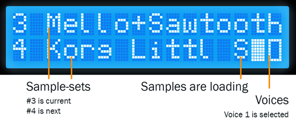

.. _system-mode-1:

System mode 1
*************



*Displaying current preset '3 Mello+Sawtooth' which has 2 voices available. The next preset is '4 Korg Little Bits'. The 'S' indicates samples are still loading in the background*

A menu system has been implemented to access:

* :ref:`setlist-functions`
* :ref:`edit-definitions`
* :ref:`auto-chords`
* :ref:`midi-mapping`
* :ref:`system-settings`
* :ref:`invert-sustain`
* :ref:`reboot-system`


*In the menu system*


.. warning::

    This feature assumes you have a `HD44780 LCD <https://en.wikipedia.org/wiki/Hitachi_HD44780_LCD_controller>`_
    module wired to your Raspberry Pi, or you have purchased an official SamplerBox Player. You may need to manually define the GPIO pins it is connected
    to in your :ref:`config.ini <config-ini>` file.

.. _setlist-functions:

Setlist functions
=================

SamplerBox can manage your sample-sets by using a setlist. On startup new folders will be detected and appended to the end of the setlist. Using the menu system you can rearrange
your sample-sets.


.. _edit-definitions:

Edit Definitions
================

You can manage the global behaviour keywords of a sample-set's ``definition.txt`` file from the menu system. These include ``%%gain``, ``%%mode``, ``%%velmode``, ``%%release``, ``%%transpose``,
``%%pitchbend``, and ``%%fillnotes``. More information about global behaviour keywords can be found :ref:`here <global-keywords>`.

.. _auto-chords:

Auto Chords
===========

SamplerBox has the ability to play chords types based on the notes you play and (optionally) in a specified key.

Chord Mode
----------

+----------------------+-------------------------------------------------------------------------+
|Mode                  || Description                                                            |
+======================+=========================================================================+
|MAJ scale chords      || Will play chords based on a specified major key.                       |
+----------------------+-------------------------------------------------------------------------+
|MIN scale chords      || Will play chords based on a specified minor key.                       |
+----------------------+-------------------------------------------------------------------------+
|All MAJ chords        || All notes will trigger a major chord based on its root note.           |
+----------------------+-------------------------------------------------------------------------+
|All MIN chords        || All notes will trigger a minor chord based on its root note.           |
+----------------------+-------------------------------------------------------------------------+

Root Key
--------

Allows you to select a key to base your chords on. Only works with chord modes ``MAJ scale chords`` and ```MIN scale chords``.


.. _midi-mapping:

MIDI Mapping
============


+----------------------+-------------------------------------------------------------------------+
|Function to map       || Description                                                            |
+======================+=========================================================================+
|Master volume         || Map any control, ideally a fader or pot, to affect the SamplerBox's    |
|                      || master volume.                                                         |
+----------------------+-------------------------------------------------------------------------+
|Voices                || Map any control to each of the 4 voices.                               |
+----------------------+-------------------------------------------------------------------------+
|Pitch bend            || Map any control to the pitch bending function. Useful if your          |
|                      || keyboard doesn't have a pitch wheel.                                   |
+----------------------+-------------------------------------------------------------------------+
|Sustain               || Map any control to the pedal sustain function. Useful if your          |
|                      || keyboard doesn't have a sustain pedal input.                           |
+----------------------+-------------------------------------------------------------------------+
|Panic key             || Map a key to kill all sounds.                                          |
+----------------------+-------------------------------------------------------------------------+
|SamplerBox Navigation || Map MIDI controls to each of the 4 navigation buttons (left, right,    |
|                      || enter and cancel). Mapping a control to one of these functions will not|
|                      || override any other controls mapped to the same function, thus allowing |
|                      || multiple mappings.                                                     |
+----------------------+-------------------------------------------------------------------------+
|Reverb                || Map any control, ideally a potentiometer, to any of the 5 reverb       |
|                      || parameters. Room size, damp, wet, dry, and width.                      |
+----------------------+-------------------------------------------------------------------------+

.. _system-settings:

System Settings
===============

Some system settings can be modified from this menu. Changing these options will save
their values to the :ref:`config.ini <config-ini>` and be read again upon a restart.

+-----------------+------------------------------------------------------------------------------+
|Option           || Description                                                                 |
+=================+==============================================================================+
|Audio device     || Select default audio device to use every time (if it can be found).         |
+-----------------+------------------------------------------------------------------------------+
|Max polyphony    || Range: 1-128. The maximum number of samples that can be played              |
|                 || simultaneously.                                                             |
+-----------------+------------------------------------------------------------------------------+
|MIDI channel     || Range: 0-16. 0 = all channels.                                              |
+-----------------+------------------------------------------------------------------------------+
|Sample rate      || Options: 44100, 48000.                                                      |
|                 || Choose a sample rate compatible with your audio device and sample-sets.     |
|                 || 44100 is usually safe.                                                      |
+-----------------+------------------------------------------------------------------------------+
|Reverb           || **Experimental**. Options: ON/OFF (requires reboot).                        |
+-----------------+------------------------------------------------------------------------------+
|Set RAM limit    || Set the amount of RAM the system can use for samples. For example,          |
|                 || a setting of 95% will see SamplerBox attempt to load as many presets        |
|                 || into memory. A setting of 5% will likely only allow for one preset at       |
|                 || a time to be loaded into memory.                                            |
+-----------------+------------------------------------------------------------------------------+

.. _invert-sustain:

Invert Sustain
==============

Invert the polarity of your sustain pedal if it is functioning in the opposite way of what is expected.

.. _reboot-system:

Reboot System
=============

Reboot the system from the menu -- safer than powering off and on again.