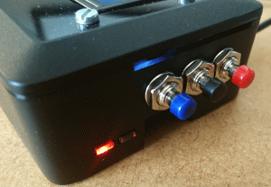
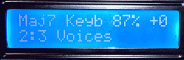

.. _system-mode-2:

System mode 2
*************

This system mode was developed in a way that assumes the user has prepared their sample-sets and configured
the `config.ini` file correctly on their PC before usage with a SamplerBox.

.. note::

    This system mode was developed by Hans Hommersom. Some more detailed information and instructions
    can be found `on his site here <http://homspace.xs4all.nl/homspace/samplerbox/>`_.

.. warning::

    This feature assumes you have a `HD44780 LCD <https://en.wikipedia.org/wiki/Hitachi_HD44780_LCD_controller>`_
    module wired to your Raspberry Pi. You will need to manually define the GPIO pins it is connected
    to in the ``config.ini`` file.

Setup
=====

Three buttons (up, down and function) must be defined in the `config.ini`. They may be GPIO buttons and/or
MIDI controls.

*GPIO buttons. Red=+   Black=function   Blue=-*

Usage
=====

Physical buttons for manual control
-----------------------------------

The box has three buttons: a function select button and two +/- buttons.
The select button walks through the available functions with the second display line showing this until
a MIDI message needing the display is received. Then the underlined letter will show on the right of the
second line preceded by a *.

Implemented functions (some can be disabled via the local config parameters):

+---------------------+---------------------------------------------------------------------------+
|Function             || Description                                                              |
+=====================+===========================================================================+
|Program/patch/preset || Range = 1-128                                                            |
|                     || This is the default and the second display line will just show the       |
|                     || actual selected patch.                                                   |
+---------------------+---------------------------------------------------------------------------+
|Volume               || Range = 0-100 (%)                                                        |
|                     || This controls the ALSA mixer = output volume. The actual volume is       |
|                     || shown as a percentage on the first display line. Boot-up volume is set   |
|                     || in the script.                                                           |
+---------------------+---------------------------------------------------------------------------+
|MIDI channel         || Range = 1-16                                                             |
|                     || Changes the channel listened to, default = 11.                           |
+---------------------+---------------------------------------------------------------------------+
|Transpose            || Range = -99 to +99                                                       |
|                     || Changes the pitch/speed (thus also the length of any loops) in semitones.|
|                     || The actual transpose value is shown in the last value on the first       |
|                     || display line.                                                            |
+---------------------+---------------------------------------------------------------------------+
|Specials             || For reprogramming presets and controllers:                               |
|                     ||                                                                          |
|                     || + Button = Renew USB will force reload of the current patch.             |
|                     || - Button = Midi mute stops the box from listening to MIDI signals.       |
|                     ||   Pressing this or any other key will unmute.                            |
+---------------------+---------------------------------------------------------------------------+
|Chords               || Empty or chord name                                                      |
|                     || Empty is single note ("normal play"), others are defined in Chords       |
|                     || definitions in the local config. Currently 15 chords are implemented.    |
+---------------------+---------------------------------------------------------------------------+

Control via the MIDI controller
-------------------------------

Your midi controller device may be capable of sending midi controls via buttons,
levers or wheels. These may be customizable, otherwise you may have to adapt the
SamplerBox script to fit to your controller.

This SamplerBox is configured to recognize next
`control change messages <https://www.midi.org/specifications/item/table-3-control-change-messages-data-bytes-2>`_:

+---------------------+---------------------------------------------------------------------------+
|MIDI message         || Description                                                              |
+=====================+===========================================================================+
|Message 12           || **Program change**                                                       |
|                     || Changes preset = sample folder. In the default implementation the        |
|                     || MIDI values (0-15) are translated to human program numbers (1-12).       |
|                     || Depending on your controller's implementation you can change this with   |
|                     || the local config to get it aligned.                                      |
+---------------------+---------------------------------------------------------------------------+
|Message 14           || **Pitch bend (wheel / joystick / knob)**                                 |
|                     || Pitch bend depth can be configured from 1 to 12 semitones via the        |
|                     || local config globally and per sample set via the definition.txt.         |
|                     || Future enhancement include an extra continuous controller for this       |
|                     || as well.                                                                 |
+---------------------+---------------------------------------------------------------------------+
|Message 11           || **Continuous controller messages:**                                      |
|                     |                                                                           |
|                     |  * Controller 7: Volume slider/knob. The LSB (controller 39) is ignored.  |
|                     |  * Controller 64: Sustain pedal                                           |
|                     |  * Controller 80: General purpose, now used for selecting voices          |
|                     |  * Controller 81: General purpose, now used for selecting chords          |
|                     |  * Controller 120/123: "All sounds off"/"all notes off"                   |
|                     |   * Both will stop playing sounds/samples and pending sustains.           |
|                     |   * Panic button usually sends such messages.                             |
+---------------------+---------------------------------------------------------------------------+

.. image:: images/display-simple.gif
*Loaded loop set without selecting further specials*

*Selected a major-7 chord and voice#2 in the set "3 Voices"*
