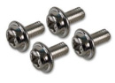

SamplerBox Player (beta) Assembly
*********************************

What you will need
==================

Here’s everything you will need to assemble the **SamplerBox Player (beta)**:

1. SamplerBox Player Kit

    a. SamplerBox Player PCB
    b. Attached LCD display
    c. Raspberry Pi mounting kit

2. Raspberry Pi. Minimal version 1B+ or higher; recommended 2 or higher
3. SD card, 2GB or larger
4. MicroUSB power cord
5. USB power adapter from reliable brand rated 2A or more
6. USB stick for samples

Getting Started
===============

.. image:: images/SamplerBoxPlayer.jpg

*SamplerBox Player PCB shown without LCD.*

1. Carefully unpack SamplerBox Kit and Raspberry Pi (not included).

.. warning::
    Ensure you are static-free.

2. Screw four enclosed stand-offs into SamplerBox PCB from the bottom in locations matching Raspberry Pi mounting holes.

.. image:: images/mounting-standoff.jpg

3. Align 40-pin connector and stand-offs with Raspberry Pi. Push PCBs together, applying force near standoffs, applying pressure to pin headers without bending the boards.

4. Secure Raspberry Pi to SamplerBox standoffs using enclosed M3 screws.

5. Insert SD card with image and USB stick with samples into Raspberry Pi.

6. Use a standard stereo cable or headphones to connect to the balanced audio output.

.. warning::
    Connecting both line out and headphones simultaneously is not recommended and may result in degraded sound quality.

7. Connect USB MIDI to Raspberry Pi USB port or serial MIDI to MIDI IN DIN port.

8. Connect power adapter to Micro USB port on SamplerBox. SamplerBox will power Raspberry Pi via GPIO connector.

.. warning::
    Keep MicroUSB port on Raspberry Pi unconnected.

