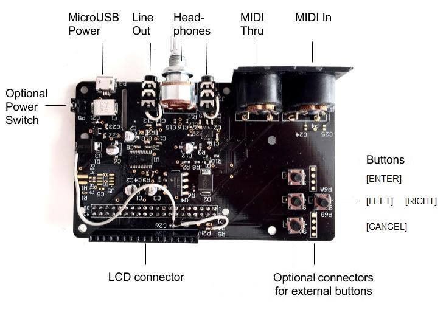
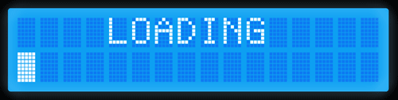

.. SamplerBox documentation master file, created by
   sphinx-quickstart on Fri Dec 02 12:02:07 2016.
   You can adapt this file completely to your liking, but it should at least
   contain the root `toctree` directive.

SamplerBox
**********

SamplerBox is a pocket-sized sound module based on `Raspberry Pi <https://www.raspberrypi.org/>`_ for use with MIDI devices in your bedroom, studio, or on the stage.
It is completely open-source which means it is forever evolving, making it a formidable alternative to other commercial MIDI samplers and expanders on the market.

*SamplerBox Player PCB (without LCD)*

*LCD loading and initial sample-set display. Line 1 = current sample-set, Line 2 = next sample-set*

.. _how-it-works:

How it works
============

SamplerBox uses MIDI messages from a connected MIDI keyboard or device to trigger digital audio samples (wave files) which are then converted to
an analogue audio signal. The software has been designed to run on `Raspberry Pi <https://www.raspberrypi.org/>`_ single-board computers. A single-board computer is a tiny computer
that contains a CPU processor, GPU, ROM, RAM, Ethernet, USB and HDMI ports. They can be programmed to do almost anything: run an operating system,
operate a security system, navigate aircraft, take over the world. In the case of SamplerBox its sole purpose is to play music!

Once SamplerBox is running, it will find sample-set directories on a connected USB drive and add them to a setlist. SamplerBox will then attempt to load sample files based on a file naming convention
or filenames and rules defined in a :ref:`definition.txt file <definition-files>`.

**Contributors**

+------------------+----------------------------------------------------------------------------------------------------------------------------------------+
|**Joseph Ernest** |twitter: `@JosephErnest <http:/twitter.com/JosephErnest>`_ mail: `contact@samplerbox.org <mailto:contact@samplerbox.org>`_              |
+------------------+----------------------------------------------------------------------------------------------------------------------------------------+
|**Alex MacRae**   |web: `GitHub <https://github.com/alexmacrae/SamplerBox>`_ mail: `alex@samplerbox.org <mailto:alex@samplerbox.org>`_                     |
+------------------+----------------------------------------------------------------------------------------------------------------------------------------+
|**Pavel Titov**   |                                                                                                                                        |
+------------------+----------------------------------------------------------------------------------------------------------------------------------------+
|**Hans Hommersom**|web: http://homspace.xs4all.nl/homspace/samplerbox/index.html                                                                           |
+------------------+----------------------------------------------------------------------------------------------------------------------------------------+
|**Erik**          |web: http://www.nickyspride.nl/sb2/                                                                                                     |
+------------------+----------------------------------------------------------------------------------------------------------------------------------------+

.. _user-docs:

.. toctree::
   :maxdepth: 3
   :caption: User Documentation
   :glob:

   features
   requirements-hardware
   installation
   config
   Using_SamplerBox/index
   Sample_Sets/index

.. _other:

.. toctree::
   :maxdepth: 2
   :caption: Other
   :glob:

   faq
   support
   license
