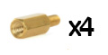

Hardware requirements and assembly
**********************************

SamplerBox Player (beta) Assembly
=================================

What you will need
------------------

To run the SamplerBox software it is essential that you have a Raspberry Pi. Version 2+ is recommended. This section also assumes you have
purchased a **SamplerBox Player (beta)** from the `SamplerBox shop <http://www.samplerbox.org/buy>`_ (pending stock).

Here's everything you will need to assemble the :

* SamplerBox Player (beta) kit

    * SamplerBox Player PCB
    * Attached LCD display
    * Raspberry Pi mounting kit

* Raspberry Pi. Minimal version 1B+ or higher; recommended 2 or higher
* Micro SD card, 2GB or larger
* MicroUSB power cord
* USB power adapter from reliable brand rated 2A or more
* USB stick for samples

Getting Started
---------------

.. image:: images/SamplerBoxPlayer.jpg

*SamplerBox Player PCB shown without LCD.*

1. Carefully unpack SamplerBox Kit and Raspberry Pi (not included).

.. warning::
    Ensure you are static-free.

2. Screw four enclosed stand-offs into SamplerBox PCB from the bottom in locations matching Raspberry Pi mounting holes.

3. Align 40-pin connector and stand-offs with Raspberry Pi. Push PCBs together, applying force near standoffs, applying pressure to pin headers without bending the boards.

4. Secure Raspberry Pi to SamplerBox standoffs using enclosed M3 screws.

.. image:: images/m3-screws.jpg

5. Insert SD card with image and USB stick with samples into Raspberry Pi.

6. Use a standard stereo cable or headphones to connect to the balanced audio output.

.. warning::
    Connecting both line out and headphones simultaneously is not recommended and may result in degraded sound quality.

7. Connect USB MIDI to Raspberry Pi USB port or serial MIDI to MIDI IN DIN port.

8. Connect power adapter to Micro USB port on SamplerBox. SamplerBox will power Raspberry Pi via GPIO connector.

.. warning::
    Keep MicroUSB port on Raspberry Pi unconnected.

----------------------------------------------

Manual assembly from components
===============================

This section is dedicated to building a SamplerBox from scratch.

What you will need
------------------

To run the SamplerBox software it is essential that you have a Raspberry Pi. Version 2+ is recommended.

Here's everything you will need to build a SamplerBox:

* 1x LCD module. A 16x2 character HD44780 LCD module is recommended
* 4x push buttons
* 1x USB DAC. A cheaper option is a PCM2704-based device
* 1x Micro SD card, 2GB or larger
* 1-2x MIDI DIN connectors (optional)
* 1x USB stick for samples
* 1x MIDI controller
* 1x MicroUSB power cord
* 1x USB power adapter from reliable brand rated 2A or more

.. note::

    The Raspberry Pi's on-board audio will work, but the quality and latency is inferior to external alternatives.

Getting started
---------------

Build instructions still to come...

Raspberry Pi only (not recommended)
===================================

It is possible to run SamplerBox with no hardware other than an essential Raspberry Pi and SD card, however you will have no visual feedback and poor audio quality.

If your MIDI keyboard controller has buttons that send MIDI messages you can assign them to the preset navigation functions in the :ref:`configuration file <config-ini>`.

It is also possible to add sample-sets to a 3rd partition on your SD card, thus removing the need for a USB stick. :ref:`More information here <sample-set-sdcard>`.

